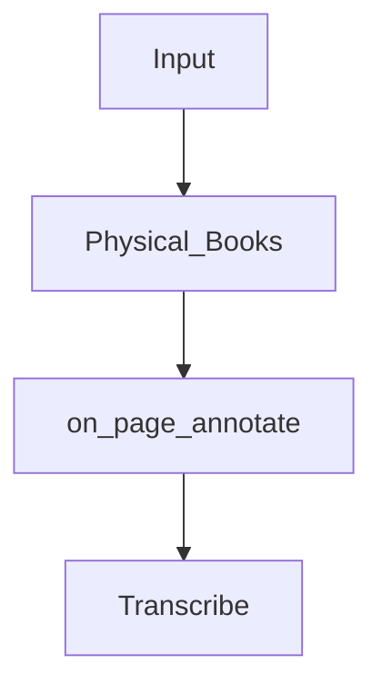

# Today's highlight
- [ ] Review my Obsidian workflow
- [ ] Figure out more with how to annotate with PDF files

# Notes
- Not sure what are we doing nowaday
- There is the question of what exactly I am trying to get done with this?
- The mermaid diagram system looks pretty interesting, building a flow diagram of my workflow should look like

# End of day
