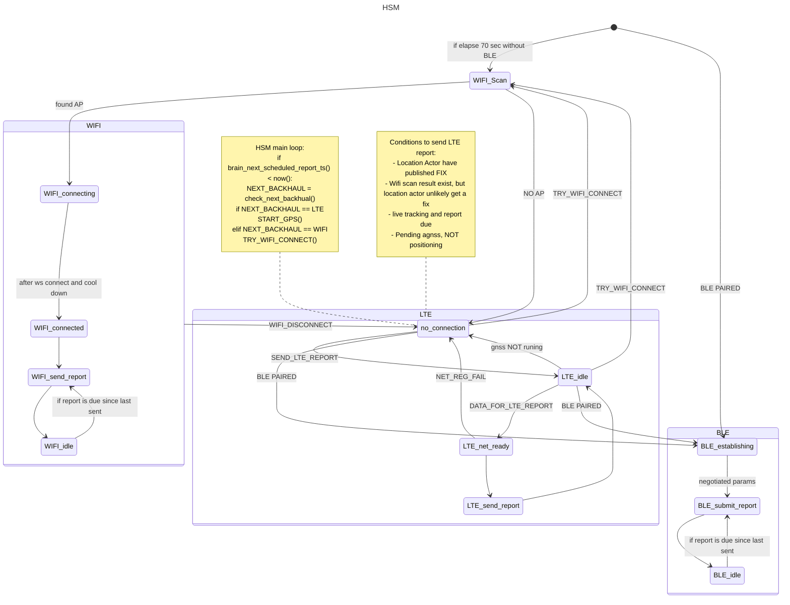
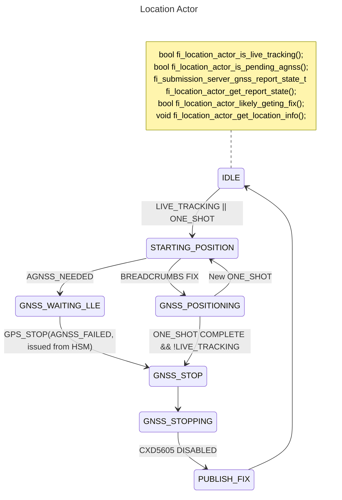

---
link:
  - "[[barking labs]]"
tags:
  - diary
  - work
---
```tasks
short mode
(path includes Work Journals) OR (filename includes Fi 2023) OR (filename includes Fi 2024)
not done
sort by created
```

**2024-03-28**
Y: More digging into 4.15 FW GPS performance data
T: Push out 4.15.8 FW to 50%, revisit issue on aggressive retries on LTE report failures

**2024-03-27**
Y: Digging into 4.15 GPS stats understanding the lower positioning success rate.
T: Discuss pushing 4.15.8 to more external users

**2024-03-26**
Y: Monitoring 4.15.8 rollout, Starting on GNSS continuous mode on BLE break
T: Continue working on GNSS continuous mode on BLE break

**2024-03-25**
Y: testing yet another hot fix for 4.15 release, Pushed out location actor mega PR 
T: More testing on location actor, maybe push out 4.15.8 hot fix to stable-rollout

- Initial state: Module last backhaul that was a stable BLE or WIFI backhaul, where more than more than **Y** success report.
- Ble/Wifi break, force enter into LTE backhaul, enable LDM and later sent LTE report. (If from firmware trigger LDM LED pattern?)
- Next report, module inform backend LDM is on, server decide if continue LDM or disable it in next response.
    - Module connected to mobile/base/wifi with more than **x** count of success report in safe zone.
    - Module connected to mobile with more than **x** minutes/success report of continues connection, disable LDM.
- If LTE registration fails, and in backoff disable LDM?

**2024-03-19**
Y: Pushing 4.15.6 to 10K external users, and more location actor testing, and slightly refactor for brain.
T: Continue monitor 4.15.6 and continue testing location actor.

Test plan:
- Boot window delay 70 sec
Repeat w/ and w/o Live tracking:
- BLE -> Wifi
- BLE -> Wifi bad -> LTE
- Wifi good -> Wifi retry
- Wifi bad -> LTE
- Wifi good -> BLE
- LTE -> Wifi
- LTE -> BLE

- LTE -> live tracking LTE
- Live tracking LTE -> LTE
- LTE NO REG start backoff

**2024-03-18**
Y: location actor changes
T: investigating 4.15.6 releases and deciding to push to more external users

- [x] Fix `../../src/libgnss_cxd5605/fi_cxd5605_gnss_server.c:94` ✅ 2024-03-25

/filog 3/18/2024 'Pushed S3 FW 4.15.6 to stable-rollout channel for 11K users'


**2024-03-15**
Y: pushing 4.15.6 to 1000 external users, and pushing new brain changes
T: Getting location actor changes tested, and PRed. And start getting various location performance changes that was pending pushed and tested.

**2024-03-14**

Y: releasing 4.15.6 to 100 external users, analyzing the release metrics 
T: getting location actor ready for pr

- [x] Update team on status of 4.15.6 rollout
- [x] Need to figure out why CXD5605 FW erased crash

**2024-03-13**
Y: Analyzing 4.15 release and preparing for external release, fixing some test rack flakiness 
T: Release 4.15 for 100 external users, continue work with location actor

```
zQIKygJYsJQEYP2YvyByLG9MeDRnRldHc3lyUzdiWmI5WXcyYUE1MFlaeG40djV1bDIvdFBLOVpabkU9mgEAsgEdCMMBEMMBIKAfKPcBMPsBOPsBQMT//////////wG4AQTAAQfKASEKCQjoDxADGA0wAxIJCOgPEAMYDTADGgkI6A8QAxgNMAOSAmIQRBjhHiBdKAMwqgE4+gFFAOA4RUioAVDa//////////8BWPkBYOj+/////////wFonnlyEAgJCw0LCgsLCwwNEBo0xwF4qAGAAagBiAH4AZAB+QGYAUSgAUSoAYkCsAHvB5oCXgodCAQQDxgGIhUzMjE2ZmYyMjktZmMzX2YzLXByb2QSIAgEEA8YAyIYZWI0NDg1ODM5LWZjM19mMy1wcm9kLWJsGhcIAhgDIhFtZndfbnJmOTE2MF8xLjMuMSICEEUCWgCmASqjAQi4DyABKAIwBzhNQN4+SAJ4A4ABRogBvgWQATGYAQOgAQOwAZCKBLgBogTIAey4AtABsWbYAQOIAvMFoAKLHcACy/VMyAKIvRTYAvOWQ+gClQPwAuRZ+AL7NYADlU6gA8UJyAMD4AMDqASsxQSwBNCwA7gEhk/ABIO6A8gE0GrQBOID2ASqXOAEl6ICoAUB2AUU4AUF6AX1BvAFWYAGtgKYBmgCYgD2BFLzBBC5Ch0O9CJCJQ34k8ItZmZmP1ABWgcIBBA+GN0BWgcIBxAOGKoCWgcICBAhGLoBWgcICRAsGKkCWgYIEBBCGCRaBggSEAcYOloGCBoQIxg7WgcIGxA6GI4BWgQIHBhxWgYIHxAYGGliBwhBEBwYvgJiBwhHEBMYxAFiBwhIEC8Y9gFiBghJEB8YO2IJCEsQHRidAiAGYgYIUhADGA1iBghTEBkYMWIGCFQQGBh3agcIAhBLGKoCagcIAxApGLIBagcIBxAUGL0CagcICBA9GIsCagYIGRApGDRqBwgeEBoY+gFqBggkEAQYfXIOKgwAAAAAAAAAAAAAAAB6DioMAAAAAAAAAAAAAAAAggEOKgwAAAAAAAAAAAAAAACNAQAAgL+iAQkI6A8QAxgNMAOqAQkI6A8QAxgNMAOyAQkI6A8QAxgNMAO4AQHAAZTOxq8G0AGJAeABAfIBHhCwCh0O9CJCJQ34k8ItAACAvzgBTQAAQEBVAABAQPIBEhCxCh0O9CJCJQ34k8ItAACAv/IBHhCyCh0O9CJCJQ34k8ItAACAvzgBTQAAsEFVAACwQfIBHhCzCh0O9CJCJQ34k8ItAACAvzgBTQAAYEFVAABgQfIBHhC0Ch0O9CJCJQ34k8ItAACAvzgBTQAA4EBVAADgQPIBHhC1Ch0O9CJCJQ34k8ItAACAvzgCTQAAIEFVAABQQfIBHhC2Ch0O9CJCJQ34k8ItAACAvzgCTQAAMEFVAABAQfIBHhC3Ch0O9CJCJQ34k8ItAACAvzgBTQAAmEFVAACYQfIBHhC4Ch0O9CJCJQ34k8ItAACAvzgDTQAAEEFVAAAwQRBCDgoMCgpBbmNob3JEb3du
```

**2024-03-11**
Y: fixing corner cases and testing for new location actor to fix lte reporting interval
T: adding some timeout and safety check into location actor, also create corresponding flow diagram for the complex state machines

- LTE one-shot cycle every 1 minute
- LTE one-shot cycle every 5 mins
- LTE live tracking
- LTE registration FAIL
- 

**2024-03-06**
- Still need a timeout mechanism 
- And a lot more unit test in brain
- also complete the flow chart diagrams
- Fix system when AGNSS is needed but FAILS or throttled
- Also report due during live tracking may still NOT be working
- Force LTE report needs to be fixed

With mobile ble:
1. While the module is connected to base/Wifi, start LDM
2. Go take a walk around, with the mobile app Bluetooth enabled
3. Come home, disable LDM

Without mobile ble:
1. Leave the house with mobile app bluetooth disabled.
2. enable LDM, walk around
3. come home, and disable LDM





- Need a check before actually sending lte report that we should send it
- Shutdown gnss if lte registration fails?
- Need to make sure the fix report type don’t get messed up when dispatched 

Y: Got a proof of concept location server in module FW working, that will handle a lot of module reporting interval during LTE
T: More work on fixing module reporting intervals

**location server**:
```
    main loop
        Is current backhaul NOT BLE or WIFI? And is there a report scheduled soon?
            S1: If so turn on CXD5605 and start positioning
                S1.1 LLE or UTC is needed from CXD5605, position can't start
                    S1.1.1 Shutdown CXD5605, we have a failed CXD5605, go to S1.3
                S1.2 CXD5605 position start one shot
                    S1.2.1 Found fix, go to S1.3
                    S1.2.2 Timed out no fix found, go to S1.3
                S1.3 CXD5605 is stopped
                    Go back to idle
            S2: Else do nothing
        Is live tracking turned on:
            S3: turn on CXD5605 and start positioning
                S3.1 LLE or UTC is needed from CXD5605, position can't start
                    Wait until LLE is complete
```
Query for location server:
- Get latest fix report
    - May return:
        - Invalid report (positioning never started)
        - Latest report with invalid fix
        - Latest report with valid fix
- Is positioning still running?
- Is live tracking right now?

**HSM**:
```
no-connection:
    have a report scheduled to be sent now.
        S1: Is positioning running and is there an valid fix?
          . Is there wifi scan data?
            If not do nothing
```

**Brain**:
- check 

**2024-03-05**
- location server
- If the module did not start CXD5605 for some reason, we should still send up report at expected interval

- Start GNSS 20 seconds before needing to send a report
    - GNSS start positioning
        - LLE is needed
            - Signal new report to be send
        - LLE is downloaded
            - Location server have been waiting, we should start positioning
        - Position starts
            - Getting reports
            - A valid fix is found
                - Signal new report to be send
            - Timed waiting for a valid fix
                - signal new report to be send
        - Reporter wish to send a report, get the current position and breadcrumb infos and send report
- When NOT live tracking, and backhaul is NOT LTE or NONE shutdown GPS

HSM:
- Should try to send GPS packet
- Ask LS for GNSS fix, if there a fix get it, if not also send it
    - Get the next burst from breadcrumb pretty much
- Send the scheduled report....
- If GNSS timeout or get a fix later, send up another report

**2024-03-04**
- Start GPS position fix
    - Send Wifi scan info early
    - GPS fix found
    - GPS fix fail timeout after 2mins
- LTE Net ready
    - Get neighbor cell (a few seconds)
- Generate report
- Send report
- Get report response (Maybe also LLE data)
- Inject LLE (8 seconds to inject, a few seconds to download LLE)

**2024-02-28**
Y: more work on getting lte submission report retry
T: monitor 4.15.5 rollout and continue debugging a pubsub crash in new lte state machine 

nrf52 Bootloader update flow
1. Update Internal Fi users to latest 4.15 App FW
2. Update Internal Fi users to latest 4.15 BL FW
3. Rollback Internal Fi users from 4.15 App FW to 4.13 FW
Ensure all users running older nrf52 App with latest BL FW are running okay and start general fleet rollout.

Rollout flow for the general fleet:
1. New test channel of 1000 users update to latest 4.15 BL+App FW
2. Rollback 1000 users back to older 4.13 App FW
3. New FW channel user get latest 4.15 BL+App FW, go through standard rollout flow of 100->1000->10000, etc units

Thinking through how re-transmitting submission reports a few wrinkles comes up:
- If the report submission fails during upload, re-transmission make sense, since backend haven't got a new report yet
- But if the report submission fails during downloading response data should we immediately re-transmit?
    - Leaning towards yes?
    - LLE data download will be throttled, so it shouldn't cause too many large data re-transmission
    - But backend would have 2 copy of the duplicated report, will need to somehow discard the repeated one?
- If we are re-transmitting should try to send the exact same data again? or re-create the submission report, since various stats counters will have changed after the first report.
    - If we recreate the submission report, and mark it as a re-transmission package, maybe that will allow backend to better handle the duplicate report?
    - Does this mean "central actor" need to be the one issuing the re-transmission logic?

**2024-02-27**
Y: Adding early LTE report during gps fix, and fixing a few 4.15 release bugs, and tuning timeout for neighbor cell scan
T: Cutting a new 4.15 release and continue on LTE state machine work

**2024-02-26**
Y: push out lte state machine extraction
T: work on early send lte report during gps fixing, and lte report resend on failure

**2024-02-23**
LTE State machine TODO:
- [ ] Fix OTA finalize step
- [x] Fix ncell fetch, and timeout ✅ 2024-02-28
- [ ] Also still getting pubsub crashes for some reason

**2024-02-22**
Y: another 4.15.x release and testing bootloader changes, and working on lte state machine extraction 
T: more lte state machine work, look into accel data sample rate issue from kennel cam data

**2024-02-20**
Y: debugging the bootloader update in the backend with FW version flapping
T: Cut a new FW release with application + bootloader, and test bootloader FW update

4.15 App FW change log
- Upload firmware version via device manifest struct in basic info
- Upload total 10 neighbor cell tower info on lte report, up from 5.
- Breadcrumb data as part of gnss data
- Live tracking use CXD5605 collect gnss data even while in BLE/Wifi mode
- Sample + upload BLE RSSI data
4.15 BL FW change log
- Delay bootloader startup with 100ms for power rail to settle
- Fix DFU update

**2024-02-19**
- [x] Investigate into accel sample rate ✅ 2024-02-23

**2024-02-14**
Y: Continue migrating LTE state machine into modem server and discussion on the design
T: hopefully finished up the lte state machine migration 

For some reason LLE download takes a long time, like we are not polling the socket?

**2024-02-12**
Y: Some adjustment to how bootoader update is triggered via mobile, and revising FW and backend changes
T: get web backend for bootloader changes finalized and continue working on extracting LTE state machine into modem server

**2024-02-09**
Y: follow up discussion on bootloader update and changing how app read fw version from module
T: work on extracting lte sub state machine into modem server.

- [x] Write up CXD5605 boot status unknown CX triage step ✅ 2024-02-14
- [ ] Write up firmware update over mobile trigger via submission report 

EOD: finished up some work for graphql q

**2024-02-08**
Y: Start extracting LTE sub state machine out of HSM, and a bit more follow up bark detection bug fixes.
T: Follow up on backend bootloader update PR, and continue with extracting LTE sub state machine out of HSM.

**2024-02-07**
Y: wrap up bark detection work, investigate module with unknown gnss boot status
T: continue with unknown gnss boot status investigation 

**2024-02-05**
Y: doing some code cleaning up on bark detection arduino code
T: continue with bark detection work

**2024-02-01**
Y: Finally cleaned up bootloader update backend PR, and unit tests
T: Doing some bootloader update test, and look to pick up new FW task


**2024-01-30**
Y: cleaned up backened bootloader update logic
T: testing db interactions for upload and downloading bootloader firmware

**2024-01-29**
Y: traveling back from NYC
T: continue web backend changes for bootloader update, figuring out how to upload  fw via endpoint into database 

**2024-01-23**
Y: digging into web backend on how firmware update work, and figuring out how to add bootloader update logic
T: Continue working on bootloader update, and traveling to NYC

The phone needs to get 

**2024-01-22**
Y: got new bootloader version flash section setup and uploading bootloader version
T: cleanup the bootloader version changes and start looking into backend process for handling bootloader update 

**2024-01-19**
Y: finish write up kennel cam data streaming changes
T: adding fw to send up bootloader fw version via device manifest

4.8.22 `BL version: 1699388787 c6a2d6f7`
4.8.11 `BL version: 1684865802 e0906b24`


**2024-01-18**
Y: Updating new kennel cam script to all rpi in the kennel, and writing up kennel cam data stream changes
T: Push new lick detection feature to internal fi users, hopefully finish up writing up for kennel cam 

**2024-01-17**
Y: Fixing kennel cam BLE compatibility issue, add backend support for device manifest msg
T: Writing up kennel cam, data stream changes, and proposed timestamp smoothing strategy.

**2024-01-16**
Y: Prior to OOO yesterday, Create a new FW and Rpi release to Kennel cam to start fixing the data timestamping issue
T: Validate the test data uploaded for kennel cam, and start working on bootloader

**2024-01-12**
Y: Discussion and planning to fixing timestamping issue with sensor data collection a kennel cam, GPS failure case study meeting
T: More GPS failure case study meeting, getting a new deployment of sensor data collection at kennel cam to start fixing timestamp issues.

- [x] Need to figure out how to update ntp on balena rpi ✅ 2024-02-01
- [ ] something wrong with collar when time is set

Loren review 

- **Knowledgeable Leadership:**
    
    - Loren possesses extensive knowledge in various technical domains and is able to connect different eng teams together.
- **Approachable Team Collaboration:**
    
    - Loren fosters a collaborative work environment, being approachable and encouraging open discussions among team members.
- **Technical Expertise and Holistic Architecture:**
    
    - Loren combines technical expertise with a holistic view of architecture, excelling in both detailed problem-solving and strategic decision-making.

**Summary:** Loren is a highly knowledgeable and approachable leader, adept at navigating technical details while maintaining a holistic view of architecture. His collaborative approach and technical expertise have significantly contributed to our team's success.

**2024-01-11**
Y: looking into new bug on ble v2 causing data drops, and kennel cam module upload data with data gaps
T: address data gap in kennel cam setup 

- restart investigation at  2024-01-11 15:52:00.711731

**2024-01-10**
Y: Fixed the module offline bug, and investigating other serial ble v2 related tickets.
T: Cut new release for new module fix, and maybe release to internal folks, and release the base FW fix

Modules that have latest base FW:
- FC33B488392
- FC33J251635
- FC33H159390

- [x] Investigate Hal's data drop ✅ 2024-01-11
- [x] Investigate new base FW, report drop ✅ 2024-01-11

- restarted sampling at 9:46 PM host_ts 2024-01-11 02:47:11.362640

**2024-01-09**
Y: Troubleshooting a bug where module with new ble v2.1 protocol becomes offline after a while.
T: Continue troubleshooting the module offline bug

Still a tons of user running into `Unexpected submission with no deviceBasicInfoSubmission` problem, part of this issue was due to old base FW not getting rolled back.
I rolled back that. 

```
src/firmware-common/external/vendor/jlink/mac-arm64/JLinkGDBServerCLExe -device NRF52840_XXAA -speed 400 -localhostonly -if SWD
```

**2024-01-08**
Y: Cut off new 4.14.1 FW for new behavior detection feature, found issue in base FW here fw update handoff is not happening
T: Troubleshoot new base FW to understand why not getting firmware update available signal correctly.

```
00:57:52.141 I [pop_state] Exiting wifi-connected:get-conn-stats
00:57:52.141 I [pop_state] Running exi00:57:52.172 I [push_state] Entering wifi-connected:submit-report
00:57:52.173 I [push_state] start_timer2
00:57:52.173 I [_act_impl_start_timer2] Starting HSM timer2 -- 60000 ms
00:57:52.173 I [push_state] wifi_submit_report
00:57:52.173 I [fi_submission_server__set_state] IDLE -> IDLE
00:57:52.177 D [encode_proto_basicinfo] bq27421 refresh found, adding to report
00:57:52.194 D [submission_data_prepare] Prepared report body: sd
wwEKwAEKEGxvY2FsLWZjM19mMy1kZXYYAViQG2Cx9tMBaEVyLE5rdmIraVRuOW9ReENOVWVtZDREaURtZFBUcmU4OGtDUWRXSEViVGx5RzA9mgEAuAEEwAEHygEYCgkI6A8QARgIMAMSCQjoDxABGAgwAxoAkgJNEGQYyiEgWygBMP8BOP8BRQDgNkVI+QFY+AFogIABchAICQsNCwoLCwsMDRAaNMcBePgBgAH5AYgB+AGQAfgBmAFkoAFkqAGJArAB7wcCWgCMASqJAQiiAyAEMAU4gwNwBHgCgAEBiAEIkAEHsAHLC7gB6gXIAbjIAdgBlAKIAr4HoAL3RsAC+ckByAKLa9gC3J8B6AKTAfAC/AL4AtsKgAPfDKAD3QHIAwbgAwb4AwGABAGoBMUUsAT7G7gErAXABMMWyATFBdgEuQHgBNMNoAUG2AUE6AUu8AUHgAYIAmIAOzo5CglkZXNjYXJ0ZXMSETZhOmQ3OjlhOjE5OjdkOmFlGghXUEEyLVBTSyABKF0yCzE5Mi4xNjguNS42GEIWCgcKBW1hcDJ1CgsKCWRlc2NhcnRlcwJyANcIggHTCBLLCAABAAAAABCAAAgAAAAAKFeEAwIAAoAEgAAAAAAAAABAAAIAAAAAOM+BQQGAAMABQAAAAAAAAAAgAAIAAAAAtBrhIADAAGABIAAAAAAAAAAQgAAAAAAAD8GgIABwAHAAEAAAAAAAAAAIQAAAAACAxlRA2YWAQAAgAPAAEBAAAAAAAAAIgAAAAACAQFBIWABQACgACAAAAAAAAAAEIAAAAACAHyIcDAAIACAABAAAAAAAAAACEAAAAACA+g4ODAAKAAwAAgIAAAAAIAABEAAAAADAnwkIBAAFAAoAAQAAAAAAAIAACAAAAABYmoWEAAACAASAgAAAAAAAAEAAAgAAAAB4fwLCAQAAwAFAAAAAAAAAACAAAQAAAABGLgFBAIAAYAAgAAAAAAAAABCAAAAAAAD00:57:52.253 I [push_state] wifi_release_sta
00:57:52.253 D [da16200_drv_set_wake_mode] da16200_drv_set_wake_mode: shutting down
00:57:52.254 D [rlog_add] Added remote log: 7
00:00:00.020 ! [log_module_details] fi_module board=3 build=local-fc3_f3-dev platform_id=<null> module_id=FC32H000328
00:00:00.021 I [fi_cpu_log_reset_reason] fi_cpu_log_reset_reason: NONE
00:00:00.026 D [bq25180_init] bq25180 reg dump
  61 00 62 50 25 5C 03 85 1A 00 E0 01 C0 | a.bP%\.......
00:00:00.032 D [bq25180_configure] bq25180 reg dump
  61 00 00 50 25 5C 03 85 1A 00 E0 01 C0 | a..P%\.......
00:00:00.540 D [self_test_bq27421] bq27421 self-test succeeded
```

```
00:49:59.324 I [module_hsm_log_state] T1=4s T2=-1s T3=-1s State=[ ble-connection, ble:establishing ]
<debug> nrf_sdh_ble: BLE event: 0x50.
00:49:59.358 D [ble_evt_handler] BLE write: 45 len=2
<debug> nrf_sdh_ble: BLE event: 0x50.
00:49:59.598 D [ble_evt_handler] BLE write: 85 len=2
00:49:59.598 D [ble_fi_serial_svc_handle_write_event] write.ctrl notify enabled? 1
<debug> nrf_sdh_ble: BLE event: 0x12.
00:49:59.628 I [print_conn_params] min=30ms max=30ms sl=0 timeout=720ms
00:49:59.628 I [module_hsm_send_event] BLE_NEGOTIATED_PARAMS
00:49:59.629 I [evaluate_transition_targets] -> 'ble:submit-report', condition 'none'
00:49:59.629 I [hsm_instance_transition] moving to state: ble:submit-report
00:49:59.629 I [transition_to_path] ble:submit-report
00:49:59.629 I [pop_state] Exiting ble:establishing
00:49:59.630 I [pop_state] Running exit action: stop_timer
00:49:59.630 I [push_state] Entering ble:submit-report
00:49:59.630 I [push_state] ble_notify_dispatch_and_submit_report
00:49:59.631 I [fi_submission_server__set_state] IDLE -> IDLE
00:49:59.631 E [ble_fi_serial_svc_is_fully_attached] read 0; write 1
00:49:59.631 I [fi_ble_send_report] Sending periodic notify-dispatch
00:49:5<debug> nrf_sdh_ble: BLE event: 0x57.
<debug> nrf_sdh_ble: BLE event: 0x50.
00:49:59.830 D [ble_evt_handler] BLE write: 88 len=2
00:49:59.831 D [ble_fi_serial_svc_handle_write_event] read.ctrl notify enabled? 1
<debug> nrf_sdh_ble: BLE event: 0x50.
00:50:00.010 D [ble_evt_handler] BLE write: 80 len=2
<debug> nrf_sdh_ble: BLE event: 0x50.
00:50:00.251 D [ble_fi_svc_handle_write_event] Received NOTIFY ACK: 4 bytes
00:50:00.251 D [ble_evt_handler] BLE write: 36 len=4
<debug> nrf_sdh_ble: BLE event: 0x50.
00:50:00.430 D [ble_evt_handler] BLE write: 62 len=2
<debug> nrf_sdh_ble: BLE event: 0x51.
00:50:09.322 D [fi_ble_log_state] BLE is attached
00:50:09.324 I [power_check_battery_charger] Battery: state 2, bq25180_stat0:0x61, is_chg:0 has_pwr:1
00:50:09.324 I [module_hsm_log_state] T1=50s T2=-1s T3=-1s State=[ ble-connection, ble:submit-report ]
00:50:09.345 D [fi_step_count_actor__store_record] seq=49 accel_mag_var=0.000 steps=0
00:50:17.884 I [bq27421_refresh_state_enter] start refresh
00:50:19.322 D [fi_ble_log_state] BLE is attached
00:50:19.324 I [power_check_battery_charger] Battery: state 2, bq25180_stat0:0x61, is_chg:0 has_pwr:1
00:50:19.324 I [module_hsm_log_state] T1=40s T2=-1s T3=-1s State=[ ble-connection, ble:submit-report ]
00:50:29.322 D [fi_ble_log_state] BLE is attached
00:50:29.324 I [power_check_battery_charger] Battery: state 2, bq25180_stat0:0x61, is_chg:0 has_pwr:1
00:50:29.324 I [module_hsm_log_state] T1=30s T2=-1s T3=-1s State=[ ble-connection, ble:submit-report ]
```

```
01:26:12.384 D [submission_data_prepare] Prepared report body: sd
hgEKgwEKEGxvY2FsLWZjM19mMy1kZXYYAVi0KGCV2bsCaEVyLE9SWWhySUNuaFNnYkw3Ym9aM0IrNUQ3eVhSYmUxTmUyYzJ0eWVRMkFnTlk9mgEAsgEQCBkQGSDwLij3ATD7ATj7AbgBBMABB8oBGAoJCOgPEAEYCTADEgkI6A8QARgJMAMaAAJaAG8qbQgDgAEBiAEHkAEDsAGbItgBrQWIAmSgAtY7wAKVpwLIArh92ALD6QHoAjXwAvwH+AKfA4ADpAWgA2/AAwHIAwLgAwL4AwKABAKoBLcVsAS0G7gEyQXABMMhyAAAAEIAACAAAAANIrIUEAIABAASAgAAAAAAACEAABAAAAAPaMcFAAEACQABAQAAAAAAABCIAAAAAAgLhFQBgAEABoAAgIQAAAAIAABGAAAAAAgBAeHFAAWABwAAQEAAAAAEAAAiAAAAAA4GwQEAgADAAQAAICAAAAAAAAAQgAAAAAwCoICAcABQAIAAEBAAAAAACAAAgAAAAAoCwEBACAAwAFgIAAAAAAAAiAAAYAAAAABAJEQwbABAADQEAAAAA<debug> nrf_sdh_ble: BLE event: 0x57.
<debug> nrf_sdh_ble: BLE event: 0x50.
01:26:13.741 D [ble_evt_handler] BLE write: 87 len=8
01:26:13.741 D [handle_serial_svc_read_endpoint_changed] Got read ctrl ACK: ID=1 len=1118
01:26:13.742 I [fi_ble_handle_server_endpoint] Send submission data(244).
01:26:13.743 I [fi_ble_handle_server_endpoint] Send submission data(244).
01:26:13.754 I [fi_ble_handle_server_endpoint] Send submission data(244).
<debug> nrf_sdh_ble: BLE event: 0x57.
01:26:13.841 I [fi_ble_handle_server_endpoint] Send submission data(244).
<debug> nrf_sdh_ble: BLE event: 0x57.
01:26:13.917 I [fi_ble_handle_server_endpoint] Send submission data(142).
<debug> nrf_sdh_ble: BLE event: 0x57.
<debug> nrf_sdh_ble: BLE event: 0x57.
<debug> nrf_sdh_ble: BLE event: 0x57.
<debug> nrf_sdh_ble: BLE event: 0x50.
01:26:14.242 D [ble_evt_handler] BLE write: 84 len=8
01:26:14.242 D [handle_serial_svc_endpoint_changed] Write endpoint changed 1 1 45
<debug> nrf_sdh_ble: BLE event: 0x57.
<debug> nrf_sdh_ble: BLE event: 0x50.
01:26:14.342 D [ble_evt_handler] BLE write: 82 len=45
01:26:14.342 I [handle_serial_svc_recv_data] Got data at 1, len 45
01:26:14.342 D [handle_serial_svc_recv_data] Got submission response chunk 45. 0 remaining. 0 current transaction
01:26:14.343 I [fi_submission_server__set_state] IDLE -> RECV_RESP
01:26:14.344 I [rlog_erase_before] Clearing remote logs before: 48
01:26:14.344 I [fi_submission_server__process_basic_response] update_report_interval: 300s
01:26:14.344 I [fi_submission_server__process_basic_response] update_no_activity_interval: 300s
01:26:14.345 I [fi_submission_server__process_basic_response] Updating led state to: 0 s
01:26:14.345 I [set_led_pattern] Disabling LED
01:26:14.345 I [fi_submission_server__process_basic_response] Updating led off after duration to: 0 s
01:26:14.345 I [fi_submission_server__process_basic_resp REPORT_RESPONSE_EXTEND
01:26:14.355 I [evaluate_transition_targets] -> '', condition 'none'
01:26:14.355 I [hsm_instance_transition] null transition
01:26:14.355 I [run_transition_actions] start_tim I [pop_state] Exiting ble:submit-report
01:26:14.366 I [pop_state] Running exit action: stop_timer
01:26:14.367 I [push_state] Entering ble:idle
01:26:14.367 I [push_state] start_timer I [bq27421_refresh_state_enter] start refresh
01:26:18.454 D [fi_ble_log_state] BLE is attached
01:26:18.454 E [fi_ble_log_state] errcnt: 29, s_hvx_count: 0
01:26:18.456 I [power_check_battery_charger] Battery: state 2, bq25180_stat0:0x61, is_chg:0 has_pwr:1
01:26:18.457 I [module_hsm_log_state] T1=44s T2=-1s T3=-1s State=[ ble-connection, ble:idle ]
01:26:28.454 D [fi_ble_log_state] BLE is attached
01:26:28.454 E [fi_ble_log_state] errcnt: 29, s_hvx_count: 0
01:26:28.456 I [power_check_battery_charger] Battery: state 2, bq25180_stat0:0x61, is_chg:0 has_pwr:1
01:26:28.457 I [module_hsm_log_state] T1=34s T2=-1s T3=-1s State=[ ble-connection, ble:idle ]
01:26:33.813 I [bq27421_print_cached_values]   Design Parameters: capacity=265mAh energy=1007mWh
  Device Type: 0x0421
  Chem ID: 0x0312
  Control_Status 1: rsvd_1=0 vok=0 rup_dis=0 ldmd=1 sleep=1 rsvd_2=0 hibernate=0 initcomp=1
  Control Status 2: res_up=0 qmax_up=0 bca=0 cca=0 calmode=0 ss=0 wdreset=0 shutdownen=0
  Flags 1: dsg=0 socf=0 soc1=0 bat_det=1 cfgupmode=0 itpor=0 rsvd_1=0 ocvtaken=1
  Flags 2: chg=0 fc=0 rsvd_2=0 ut=0 ot=0
  Voltage: 4298mV
  Average Current: 0mAh
  Average Power: 0mWh
  State of Charge: 100%
  State of Health: 92% (status 1)
  Temperature: 2928
  Remaining Capacity:  250mAh
  Full-Charge Capacity: 249mAh
  Nominal Available Capacity: 256mAh
  Remaining Capacity: unfiltered=249mAh filtered=250mAh
  Full-Charge Capacity: unfiltered=249mAh filtered=249mAh
  State of Charge (unfiltered): 100%
  Learning: Qmax=16384 Ra=[8 9 11 13 11 10 11 11 11 12 13 16 26 52 199]
01:26:33.815 I [bq27421_refresh_state_update] Refresh success, next in 60000ms
01:26:38.454 D [fi_ble_log_state] BLE is attached
01:26:38.454 E [fi_ble_log_state] errcnt: 29, s_hvx_count: 0
01:26:38.456 I [power_check_battery_charger] Battery: state 2, bq25180_stat0:0x61, is_chg:0 has_pwr:1
01:26:38.457 I [module_hsm_log_state] T1=24s T2=-1s T3=-1s State=[ ble-connection, ble:idle ]
01:26:48.454 D [fi_ble_log_state] BLE is attached
01:26:48.454 E [fi_ble_log_state] errcnt: 29, s_hvx_count: 0
01:26:48.456 I [power_check_battery_charger] Battery: state 2, bq25180_stat0:0x61, is_chg:0 has_pwr:1
01:26:48.457 I [module_hsm_log_state] T1=14s T2=-1s T3=-1s State=[ ble-connection, ble:idle ]
01:26:58.454 D [fi_ble_log_state] BLE is attached
01:26:58.454 E [fi_ble_log_state] errcnt: 29, s_hvx_count: 0
01:26:58.456 I [power_check_battery_charger] Battery: state 2, bq25180_stat0:0x61, is_chg:0 has_pwr:1
01:26:58.457 I [module_hsm_log_state] T1=4s T2=-1s T3=-1s State=[ ble-connection, ble:idle ]
01:27:03.368 I [module_hsm_send_event] TIMER
01:27:03.368 I [evaluate_transition_targets] -> 'ble:submit-report', condition 'none'
01:27:03.368 I [hsm_instance_transition] moving to state: ble:submit-report
01:27:03.369 I [transition_to_path] ble:submit-report
01:27:03.369 I [pop_state] Exiting ble:idle
01:27:03.369 I [pop_state] Running exit action: stop_timer
01:27:03.369 I [push_state] Entering ble:submit-report
01:27:03.370 I [push_state] ble_notify_dispatch_and_submit_report
01:27:03.370 I [fi_submission_server__set_state] IDLE -> IDLE
01:27:03.370 E [ble_fi_serial_svc_is_fully_attached] read 1; write 1
01:27:03.374 D [encode_proto_basicinfo] bq27421 refresh found, adding to report
01:27:03.386 D [submission_data_prepare] Prepared report body: sd
1gEK0wEKEGxvY2FsLWZjM19mMy1kZXYYAVjnKGDO574CaEVyLE9SWWhySUNuaFNnYkw3Ym9aM0IrNUQ3eVhSYmUxTmUyYzJ0eWVRMkFnTlk9mgEAsgEQCBkQGSDwLij3ATD7ATj7AbgBBMABB8oBGAoJCOgPEAEYCTADEgkI6A8QARgJMAMaAJICTRBkGMohIFwoATCAAjiAAkUAADdFSPoBWPkBaICAAXIQCAkLDQsKCwsLDA0QGjTHAXj5AYAB+gGIAfkBkAH5AZgBZKABZKgBiQKwAe8HAloAbyptCAOAAQGIAQeQAQOwAc4i2AGtABEAAAAAAgKwrKAwABAAYAAQEAAAAAEAABCAAAAAAYBAYEBgAGAAWAAIAAAAAAAAAAQgAAAAA8BkLBwYAAQAMAAEBAAAAABCAAAgAAAAA+G4GBQKAA4AGgIAAAAAAAAhAAAQAAAAANEFCwgKAAYABQEAAAAAAAAQgAAIAAAAAhIAhgQHgAYAAICAAAAAAAAIgAAIAAAAAQqCQMAFgATABEBAAAAAAAAEIgAAAAAAA3U04KABAAGgACAgAAAAAgAA<debug> nrf_sdh_ble: BLE event: 0x57.
<debug> nrf_sdh_ble: BLE event: 0x50.
01:27:04.718 D [ble_evt_handler] BLE write: 87 len=8
01:27:04.718 D [handle_serial_svc_read_endpoint_changed] Got read ctrl ACK: ID=1 len=1166
01:27:04.718 I [fi_ble_handle_server_endpoint] Send submission data(244).
01:27:04.719 I [fi_ble_handle_server_endpoint] Send submission data(244).
01:27:04.730 I [fi_ble_handle_server_endpoint] Send submission data(244).
<debug> nrf_sdh_ble: BLE event: 0x57.
01:27:04.817 I [fi_ble_handle_server_endpoint] Send submission data(244).
<debug> nrf_sdh_ble: BLE event: 0x57.
01:27:04.844 I [fi_ble_handle_server_endpoint] Send submission data(190).
<debug> nrf_sdh_ble: BLE event: 0x57.
<debug> nrf_sdh_ble: BLE event: 0x57.
<debug> nrf_sdh_ble: BLE event: 0x57.
<debug> nrf_sdh_ble: BLE event: 0x50.
01:27:06.367 D [ble_evt_handler] BLE write: 84 len=8
01:27:06.367 D [handle_serial_svc_endpoint_changed] Write endpoint changed 1 1 45
<debug> nrf_sdh_ble: BLE event: 0x57.
<debug> nrf_sdh_ble: BLE event: 0x50.
01:27:06.468 D [ble_evt_handler] BLE write: 82 len=45
01:27:06.468 I [handle_serial_svc_recv_data] Got data at 1, len 45
01:27:06.468 D [handle_serial_svc_recv_data] Got submission response chunk 45. 0 remaining. 0 current transaction
01:27:06.469 I [fi_submission_server__set_state] IDLE -> RECV_RESP
01:27:06.469 I [rlog_erase_before] Clearing remote logs before: 48
01:27:06.470 I [fi_submission_server__process_basic_response] update_report_interval: 300s
01:27:06.470 I [fi_submission_server__process_basic_response] update_no_activity_interval: 300s
01:27:06.470 I [fi_submission_server__process_basic_response] Updating led state to: 0 s
01:27:06.471 I [set_led_pattern] Disabling LED
01:27:06.471 I [fi_submission_server__process_basic_response] Updating led off after duration to: 0 s
01:27:06.471 I [fi_submission_server__process_basic_respORT_RESPONSE_EXTEND
01:27:06.481 I [evaluate_transition_targets] -> '', condition 'none'
01:27:06.481 I [hsm_instance_transition] null transition
01:27:06.481 I [run_transition_actions] start_timerp_state] Exiting ble:submit-report
01:27:06.492 I [pop_state] Running exit action: stop_timer
01:27:06.492 I [push_state] Entering ble:idle
01:27:06.493 I [push_state] start_timer
01:27:001:27:08.454 D [fi_ble_log_state] BLE is attached
01:27:08.454 E [fi_ble_log_state] errcnt: 33, s_hvx_count: 0
01:27:08.456 I [power_check_battery_charger] Battery: state 2, bq25180_stat0:0x61, is_chg:0 has_pwr:1
01:27:08.457 I [utc_wallclock_sync] Syncing UTC clock
01:27:08.465 I [module_hsm_log_state] T1=47s T2=-1s T3=-1s State=[ ble-connection, ble:idle ]
01:27:08.466 D [fi_step_count_actor__store_record] seq=86 accel_mag_var=0.000 steps=0
01:27:18.454 D [fi_ble_log_state] BLE is attached
01:27:18.454 E [fi_ble_log_state] errcnt: 33, s_hvx_count: 0
01:27:18.456 I [power_check_battery_charger] Battery: state 2, bq25180_stat0:0x61, is_chg:0 has_pwr:1
01:27:18.457 I [module_hsm_log_state] T1=37s T2=-1s T3=-1s State=[ ble-connection, ble:idle ]
01:27:28.454 D [fi_ble_log_state] BLE is attached
01:27:28.454 E [fi_ble_log_state] errcnt: 33, s_hvx_count: 0
01:27:28.456 I [power_check_battery_charger] Battery: state 2, bq25180_stat0:0x61, is_chg:0 has_pwr:1
01:27:28.457 I [module_hsm_log_state] T1=27s T2=-1s T3=-1s State=[ ble-connection, ble:idle ]
01:27:33.815 I [bq27421_refresh_state_enter] start refresh
01:27:38.454 D [fi_ble_log_state] BLE is attached
01:27:38.454 E [fi_ble_log_state] errcnt: 33, s_hvx_count: 0
01:27:38.456 I [power_check_battery_charger] Battery: state 2, bq25180_stat0:0x61, is_chg:0 has_pwr:1
01:27:38.457 I [module_hsm_log_state] T1=17s T2=-1s T3=-1s State=[ ble-connection, ble:idle ]
01:27:48.454 D [fi_ble_log_state] BLE is attached
01:27:48.454 E [fi_ble_log_state] errcnt: 33, s_hvx_count: 0
01:27:48.456 I [power_check_battery_charger] Battery: state 2, bq25180_stat0:0x61, is_chg:0 has_pwr:1
01:27:48.457 I [module_hsm_log_state] T1=7s T2=-1s T3=-1s State=[ ble-connection, ble:idle ]
01:27:50.948 I [bq27421_print_cached_values]   Design Parameters: capacity=265mAh energy=1007mWh
  Device Type: 0x0421
  Chem ID: 0x0312
  Control_Status 1: rsvd_1=0 vok=0 rup_dis=0 ldmd=1 sleep=1 rsvd_2=0 hibernate=0 initcomp=1
  Control Status 2: res_up=0 qmax_up=0 bca=0 cca=0 calmode=0 ss=0 wdreset=0 shutdownen=0
  Flags 1: dsg=0 socf=0 soc1=0 bat_det=1 cfgupmode=0 itpor=0 rsvd_1=0 ocvtaken=1
  Flags 2: chg=0 fc=0 rsvd_2=0 ut=0 ot=0
  Voltage: 4298mV
  Average Current: 0mAh
  Average Power: 0mWh
  State of Charge: 100%
  State of Health: 92% (status 1)
  Temperature: 2927
  Remaining Capacity:  250mAh
  Full-Charge Capacity: 249mAh
  Nominal Available Capacity: 256mAh
  Remaining Capacity: unfiltered=249mAh filtered=250mAh
  Full-Charge Capacity: unfiltered=249mAh filtered=249mAh
  State of Charge (unfiltered): 100%
  Learning: Qmax=16384 Ra=[8 9 11 13 11 10 11 11 11 12 13 16 26 52 199]
01:27:50.951 I [bq27421_refresh_state_update] Refresh success, next in 60000ms
01:27:55.494 I [module_hsm_send_event] TIMER
01:27:55.494 I [evaluate_transition_targets] -> 'ble:submit-report', condition 'none'
01:27:55.494 I [hsm_instance_transition] moving to state: ble:submit-report
01:27:55.495 I [transition_to_path] ble:submit-report
01:27:55.495 I [pop_state] Exiting ble:idle
01:27:55.495 I [pop_state] Running exit action: stop_timer
01:27:55.495 I [push_state] Entering ble:submit-report
01:27:55.496 I [push_state] ble_notify_dispatch_and_submit_report
01:27:55.496 I [fi_submission_server__set_state] IDLE -> IDLE
01:27:55.496 E [ble_fi_serial_svc_is_fully_attached] read 1; write 1
01:27:55.500 D [encode_proto_basicinfo] bq27421 refresh found, adding to report
01:27:55.512 D [submission_data_prepare] Prepared report body: sd
1gEK0wEKEGxvY2FsLWZjM19mMy1kZXYYAVibKWDs/sECaEVyLE9SWWhySUNuaFNnYkw3Ym9aM0IrNUQ3eVhSYmUxTmUyYzJ0eWVRMkFnTlk9mgEAsgEQCBkQGSDwLij3ATD7ATj7AbgBBMABB8oBGAoJCOgPEAEYCTADEgkI6A8QARgJMAMaAJICTRBkGMohIFwoATCAAjiAAkUA8DZFSPoBWPkBaICAAXIQCAkLDQsKCwsLDA0QGjTHAXj5AYAB+gGIAfkBkAH5AZgBZKABZKgBiQKwAe8HAloAbyptCAOAAQGIAQeQAQOwAYIj2AGtAAAAAACEAAAAAAgOdCQCAAKABIAAgIAAAAAAAABEAAAAAAQAInIAQADAAoAAQEAAAAAEAAAiAAAAAAAFsVEA4ABAAMAAIAAAAAAAAAARAAAAAAUAsICAEACAAIAAEBAAAAAACAAAgAAAAAGCgFhAIAAYAFgIAAAAAAAAhAAAIAAAAAaIsCggEAAcACQAAAAAAAAAAgAAEAAAAAFjAhIQBAAEAAIAAAAAAAAAAQgAAAAAAA1peAQABwAGAAEBAAAA55.529 D [rlog_add] Added remote log: 7
<debug> nrf_sdh_ble: BLE event: 0x57.
01:28:08.096 I [utc_wallclock_sync] Syncing UTC clock
01:28:08.454 D [fi_ble_log_state] BLE is attached
01:28:08.454 E [fi_ble_log_state] errcnt: 34, s_hvx_count: 0
01:28:08.456 I [power_check_battery_charger] Battery: state 2, bq25180_stat0:0x61, is_chg:0 has_pwr:1
01:28:08.457 I [module_hsm_log_state] T1=47s T2=-1s T3=-1s State=[ ble-connection, ble:submit-report ]
01:28:08.466 D [fi_step_count_actor__store_record] seq=87 accel_mag_var=0.000 steps=0
<debug> nrf_sdh_ble: BLE event: 0x11.
01:28:10.018 I [ble_evt_handler] disconnected
01:28:10.019 I [on_adv_evt] Fast advertising.
01:28:10.019 I [module_hsm_send_event] BLE_DISCONNECT
01:28:10.019 I [evaluate_transition_targets] -> 'no-connection', condition 'none'
01:28:10.020 I [hsm_instance_transition] moving to state: no-connection
01:28:10.020 I [transition_to_path] no-connection
01:28:10.020 I [pop_state] Exiting ble:submit-report
01:28:10.020 I [pop_state] Running exit action: stop_timer
01:28:10.021 I [pop_state] Exiting ble-connection
01:28:10.021 I [pop_state] Running exit action: ble_stop
01:28:10.021 D [brain_consume_event] 4
01:28:10.021 I [run_transition_actions] report_disconnected_from_stable
0rlog_add] Added remote log: 7
<debug> nrf_sdh_ble: BLE event: 0x10.
01:28:12.238 I [ble_evt_handler] connected
01:28:12.238 D [ble_evt_handler] reconnect_count=1 longest_disconnect=2220ms
01:28:12.238 I [print_conn_params] min=25ms max=25ms sl=0 timeout=6000ms
01:28:12.239 I [module_hsm_send_event] BLE_NEGOTIATED_PARAMS
01:28:12.239 W [hsm_instance_transition] state='no-connection', Unexpected event 'BLE_NEGOTIATED_PARAMS'
01:28:12.240 D [rlog_add] Added remote log: 7
<debug> nrf_ble_gatt: Requesting to update ATT MTU to 247 bytes on connection 0x0.
<debug> nrf_ble_gatt: Updating data length to 251 on connection 0x0.
01:28:12.250 D [execute_evt_callback] BLE connected! peer=2a:af:03:a8:91:10 addr_id_peer=0 addr_type=0
<debug> nrf_sdh_ble: BLE event: 0x24.
01:28:12.318 I [ble_evt_handler] DLE update tx=251B rx=251B tx_time=2120us rx_time=2120us
<debug> nrf_ble_gatt: Data length updated to 251 on connection 0x0.
<debug> nrf_ble_gatt: max_rx_octets: 251
<debug> nrf_ble_gatt: max_tx_octets: 251
<debug> nrf_ble_gatt: max_rx_time: 2120
<debug> nrf_ble_gatt: max_tx_time: 2120
<debug> nrf_sdh_ble: BLE event: 0x3A.
01:28:12.368 I [ble_evt_handler] MTU exchange response 247 bytes
<debug> nrf_ble_gatt: ATT MTU updated to 247 bytes on connection 0x0 (response).
01:28:12.368 I [gatt_evt_handler] GATT ATT MTU on connection 0x0 changed to 247.
<debug> nrf_sdh_ble: BLE event: 0x55.
<debug> nrf_ble_gatt: Peer on connection 0x0 requested an ATT MTU of 500 bytes.
<debug> nrf_ble_gatt: Updating ATT MTU to 247 bytes (desired: 247) on connection 0x0.
01:28:14.593 I [gatt_evt_handler] GATT ATT MTU on connection 0x0 changed to 247.
<debug> nrf_sdh_ble: BLE event: 0x50.
01:28:14.643 D [ble_evt_handler] BLE write: 13 len=2
<debug> nrf_sdh_ble: BLE event: 0x50.
01:28:14.818 D [ble_evt_handler] BLE write: 34 len=2
<debug> nrf_sdh_ble: BLE event: 0x50.
01:28:14.868 D [ble_fi_svc_handle_write_event] Received CTRL POINT cmd: 1
01:28:14.868 I [fi_ble_attach] central issued attach
01:28:14.869 D [rlog_add] Added remote log: 12
01:28:14.869 D [ble_evt_handler] BLE write: 40 len=1
01:28:14.881 I [module_hsm_send_event] BLE_CONNECT
01:28:14.881 I [evaluate_transition_targets] -> 'ble-connection', condition 'none'
01:28:14.881 I [hsm_instance_transition] moving to state: ble-connection
01:28:14.881 I [transition_to_path] ble-connection
01:28:14.882 I [pop_state] Exiting no-connection
01:28:14.882 I [pop_state] Running exit action: stop_timer
01:28:14.882 I [push_state] Entering ble-connection
01:28:14.882 I [push_state] ble_start
01:28:14.883 D [brain_consume_event] 3
01:28:14.883 I [push_state] lte_stop
01:28:14.908 D [brain_consume_event] 6
01:28:14.908 I [transition_to_path] Entering sub-machine: ble-connection
01:28:14.908 I [transition_to_path] ble:establishing
01:28:14.909 I [push_state] Entering ble:establishing
01:28:14.909 I [push_state] start_timer
01:28:14.909 I [_act_impl_start_timer] Starting HSM timer -- 5000 ms
01:28:14.910 D [rlog_add] Added remote log: 7
01:28:14.910 I [module_hsm_send_event] LTE_MODEM_SLEEP
01:28:14.911 W [hsm_instance_transition] state='ble:establishing', Unexpected event 'LTE_MODEM_SLEEP'
01:28:14.911 D [rlog_add] Added remote log: 7
<debug> nrf_sdh_ble: BLE event: 0x50.
01:28:15.068 D [ble_evt_handler] BLE write: 80 len=2
<debug> nrf_sdh_ble: BLE event: 0x50.
01:28:15.168 D [ble_evt_handler] BLE write: 85 len=2
01:28:15.168 D [ble_fi_serial_svc_handle_write_event] write.ctrl notify enabled? 1
<debug> nrf_sdh_ble: BLE event: 0x50.
01:28:15.268 D [ble_evt_handler] BLE write: 88 len=2
01:28:15.268 D [ble_fi_serial_svc_handle_write_event] read.ctrl notify enabled? 1
<debug> nrf_sdh_ble: BLE event: 0x50.
01:28:17.018 D [ble_evt_handler] BLE write: 62 len=2
01:28:18.454 D [fi_ble_log_state] BLE is attached
01:28:18.456 I [power_check_battery_charger] Battery: state 2, bq25180_stat0:0x61, is_chg:0 has_pwr:1
01:28:18.456 I [module_hsm_log_state] T1=1s T2=-1s T3=-1s State=[ ble-connection, ble:establishing ]
01:28:19.909 I [module_hsm_send_event] TIMER
01:28:19.909 I [evaluate_transition_targets] -> 'ble:idle', condition 'none'
01:28:19.910 I [hsm_instance_transition] moving to state: ble:idle
01:28:19.910 I [transition_to_path] ble:idle
01:28:19.910 I [pop_state] Exiting ble:establishing
01:28:19.910 I [pop_state] Running exit action: stop_timer
01:28:19.910 I [push_state] Entering ble:idle
01:28:19.911 I [push_state] start_timer
01:28:19.911 I [_act_impl_start_timer] Starting HSM timer -- 49000 ms
01:28:19.911 I [push_state] check_gps_is_on
01:28:19.912 D [rlog_add] Added remote log: 7
01:28:28.454 D [fi_ble_log_state] BLE is attached
01:28:28.456 I [power_check_battery_charger] Battery: state 2, bq25180_stat0:0x61, is_chg:0 has_pwr:1
01:28:28.456 I [module_hsm_log_state] T1=40s T2=-1s T3=-1s State=[ ble-connection, ble:idle ]
01:28:38.454 D [fi_ble_log_state] BLE is attached
01:28:38.456 I [power_check_battery_charger] Battery: state 2, bq25180_stat0:0x61, is_chg:0 has_pwr:1
01:28:38.456 I [module_hsm_log_state] T1=30s T2=-1s T3=-1s State=[ ble-connection, ble:idle ]
01:28:48.454 D [fi_ble_log_state] BLE is attached
01:28:48.456 I [power_check_battery_charger] Battery: state 2, bq25180_stat0:0x61, is_chg:0 has_pwr:1
01:28:48.456 I [module_hsm_log_state] T1=20s T2=-1s T3=-1s State=[ ble-connection, ble:idle ]
01:28:50.950 I [bq27421_refresh_state_enter] start refresh
01:28:58.454 D [fi_ble_log_state] BLE is attached
01:28:58.456 I [power_check_battery_charger] Battery: state 2, bq25180_stat0:0x61, is_chg:0 has_pwr:1
01:28:58.456 I [module_hsm_log_state] T1=10s T2=-1s T3=-1s State=[ ble-connection, ble:idle ]
01:29:08.082 I [utc_wallclock_sync] Syncing UTC clock
01:29:08.091 I [bq27421_print_cached_values]   Design Parameters: capacity=265mAh energy=1007mWh
  Device Type: 0x0421
  Chem ID: 0x0312
  Control_Status 1: rsvd_1=0 vok=0 rup_dis=0 ldmd=1 sleep=1 rsvd_2=0 hibernate=0 initcomp=1
  Control Status 2: res_up=0 qmax_up=0 bca=0 cca=0 calmode=0 ss=0 wdreset=0 shutdownen=0
  Flags 1: dsg=0 socf=0 soc1=0 bat_det=1 cfgupmode=0 itpor=0 rsvd_1=0 ocvtaken=1
  Flags 2: chg=0 fc=0 rsvd_2=0 ut=0 ot=0
  Voltage: 4298mV
  Average Current: 0mAh
  Average Power: 0mWh
  State of Charge: 100%
  State of Health: 92% (status 1)
  Temperature: 2927
  Remaining Capacity:  250mAh
  Full-Charge Capacity: 249mAh
  Nominal Available Capacity: 256mAh
  Remaining Capacity: unfiltered=249mAh filtered=250mAh
  Full-Charge Capacity: unfiltered=249mAh filtered=249mAh
  State of Charge (unfiltered): 100%
  Learning: Qmax=16384 Ra=[8 9 11 13 11 10 11 11 11 12 13 16 26 52 199]
01:29:08.094 I [bq27421_refresh_sta01:29:08.454 D [fi_ble_log_state] BLE is attached
01:29:08.456 I [power_check_battery_charger] Battery: state 2, bq25180_stat0:0x61, is_chg:0 has_pwr:1
01:29:08.456 I [module_hsm_log_state] T1=0s T2=-1s T3=-1s State=[ ble-connection, ble:idle ]
01:29:08.466 D [fi_step_count_actor__store_record] seq=88 accel_mag_var=0.000 steps=0
01:29:08.911 I [module_hsm_send_event] TIMER
01:29:08.911 I [evaluate_transition_targets] -> 'ble:submit-report', condition 'none'
01:29:08.911 I [hsm_instance_transition] moving to state: ble:submit-report
01:29:08.912 I [transition_to_path] ble:submit-report
01:29:08.912 I [pop_state] Exiting ble:idle
01:29:08.912 I [pop_state] Running exit action: stop_timer
01:29:08.912 I [push_state] Entering ble:submit-report
01:29:08.913 I [push_state] ble_notify_dispatch_and_submit_report
01:29:08.913 I [fi_submission_server__set_state] IDLE -> IDLE
01:29:08.913 E [ble_fi_serial_svc_is_fully_attached] read 1; write 1
01:29:08.917 D [encode_proto_basicinfo] bq27421 refresh found, adding to report
01:29:08.931 D [submission_data_prepare] Prepared report body: sd
2wEK2AEKEGxvY2FsLWZjM19mMy1kZXYYAVjkKWC1vMYCaEVyLE9SWWhySUNuaFNnYkw3Ym9aM0IrNUQ3eVhSYmUxTmUyYzJ0eWVRMkFnTlk9mgEAsgEVCBkQGSDwLij3ATD7ATj7AUgBUKwRuAEEwAEHygEYCgkI6A8QARgJMAMSCQjoDxABGAkwAxoAkgJNEGQYyiEgXCgBMIACOIACRQDwNkVI+gFY+QFogIABchAICQsNCwoLCwsMDRAaNMcBePkBgAH6AYgB+QGQAfkBmAFkoAFkqAGJArAB7wcCWgBwKm4IA4ABAYgBB5ABBLABCDQoLCglkZXNjYXJ0ZXOpBYIBpQUSnQUAAQAAAAAAgAAIAAAAABACBgUHAAiAAoCAAAAAAAAIgAAEAAAAAAiUAsICgANAAkAAAAAAAAAAIAACAAAAANot4SAAYACgACAgAAAAAAAAEAABAAAAAHCNgBAAQABgABAQAAAAAAABCIAAAAAAAGVWQBAAMAAwAAgIAAAAAIAABEAAAAAAwEcnIBgAGAAgAAQEAAAAAEAAAiAAAAAAgHwUFAQACgAMAAI229586,0,58880,36c74e60
a4
5289586,0,58880,36d0a991
mlog
Dwjp574COggIDRASGAUgAQ8I8/++AjoICBIQEhgRIAEPCP//vgI6CAgSEA0YDyABDwiI/8ECOggIDRASGAUgAQ8IqfDCAjoICBIQBhgHIAENCM+BwwI6BggGEAYYCCAIlJbDAmIZChVjZW50cmFsIGlzc3VlZCBhdHRhY2gQAQ8IvZbDAjoICAYQCxgCIAENCL+WwwI01:29:18.454 D [fi_ble_log_state] BLE is attached
01:29:18.456 I [power_check_battery_charger] Battery: state 2, bq25180_stat0:0x61, is_chg:0 has_pwr:1
01:29:18.456 I [module_hsm_log_state] T1=50s T2=-1s T3=-1s State=[ ble-connection, ble:submit-report ]
01:29:28.454 D [fi_ble_log_state] BLE is attached
01:29:28.456 I [power_check_battery_charger] Battery: state 2, bq25180_stat0:0x61, is_chg:0 has_pwr:1
01:29:28.456 I [module_hsm_log_state] T1=40s T2=-1s T3=-1s State=[ ble-connection, ble:submit-report ]
01:29:38.454 D [fi_ble_log_state] BLE is attached
01:29:38.456 I [power_check_battery_charger] Battery: state 2, bq25180_stat0:0x61, is_chg:0 has_pwr:1
01:29:38.456 I [module_hsm_log_state] T1=30s T2=-1s T3=-1s State=[ ble-connection, ble:submit-report ]
01:29:48.454 D [fi_ble_log_state] BLE is attached
01:29:48.456 I [power_check_battery_charger] Battery: state 2, bq25180_stat0:0x61, is_chg:0 has_pwr:1
01:29:48.456 I [module_hsm_log_state] T1=20s T2=-1s T3=-1s State=[ ble-connection, ble:submit-report ]
01:29:58.454 D [fi_ble_log_state] BLE is attached
01:29:58.456 I [power_check_battery_charger] Battery: state 2, bq25180_stat0:0x61, is_chg:0 has_pwr:1
01:29:58.456 I [module_hsm_log_state] T1=10s T2=-1s T3=-1s State=[ ble-connection, ble:submit-report ]
01:30:08.094 I [utc_wallclock_sync] Syncing UTC clock
01:30:08.103 I [bq27421_refresh_state_enter] start refresh
01:30:08.454 D [fi_ble_log_state] BLE is attached
01:30:08.456 I [power_check_battery_charger] Battery: state 2, bq25180_stat0:0x61, is_chg:0 has_pwr:1
01:30:08.456 I [module_hsm_log_state] T1=0s T2=-1s T3=-1s State=[ ble-connection, ble:submit-report ]
01:30:08.466 D [fi_step_count_actor__store_record] seq=89 accel_mag_var=0.000 steps=0
01:30:08.951 I [module_hsm_send_event] TIMER
01:30:08.951 I [evaluate_transition_targets] -> 'ble:idle', condition 'none'
01:30:08.951 I [hsm_instance_transition] moving to state: ble:idle
01:30:08.952 I [transition_to_path] ble:idle
01:30:08.952 I [pop_state] Exiting ble:submit-report
01:30:08.952 I [pop_state] Running exit action: stop_timer
01:30:08.952 I [run_transition_actions] submission_server_timeout
01:30:08.953 I [fi_submission_server__set_state] IDLE -> COMPLETE
01:30:08.953 I [push_state] Entering ble:idle
01:30:08.953 I [push_state] start_timer
01:30:08.953 I [_act_impl_start_timer] Starting HSM timer -- 49000 ms
01:30:08.954 I [push_state] check_gps_is_on
01:30:08.955 D [rlog_add] Added remote log: 7
01:30:08.955 I [fi_submission_server__set_state] COMPLETE -> IDLE
01:30:18.454 D [fi_ble_log_state] BLE is attached
01:30:18.456 I [power_check_battery_charger] Battery: state 2, bq25180_stat0:0x61, is_chg:0 has_pwr:1
01:30:18.456 I [module_hsm_log_state] T1=39s T2=-1s T3=-1s State=[ ble-connection, ble:idle ]
01:30:25.236 I [bq27421_print_cached_values]   Design Parameters: capacity=265mAh energy=1007mWh
  Device Type: 0x0421
  Chem ID: 0x0312
  Control_Status 1: rsvd_1=0 vok=0 rup_dis=0 ldmd=1 sleep=1 rsvd_2=0 hibernate=0 initcomp=1
```

**2024-01-05**
Y: work on module version manifests, pushed latest base fw to Fi internal users
T: analyze base releases data, cut new ble v2.1 module fw to new behavior detection feature

- [x] Update LLE Throttle to 100%? ✅ 2024-03-18
- [x] Fix fwup via base handoff not happening ✅ 2024-01-08

**2024-01-04**
Y: Figure out the issue the with my base dev kit due to wall power issue.
T: Release base FW to internal fi users, and cut new module FW release for BLE v2.1

**2024-01-03**
Y: caught up on kennel cam next step work, and testing new BLE v2.1 FW and new base FW
T: continue testing the new base FW and get it ready for internal release to fi folks

```
select
*
from
main.fi_kennelcam.sensor_collect
where
feed_name = 'billowing-rain'
and host_ts > '2024-01-02 13:55:00.0' and host_ts < '2024-01-03 14:55:00.0'
and module_id = 'FC32H000328'
order by
mod_ts
```

- Discussion on GPS location debugging.

**2024-01-02**
Y: OOO
T: Catch up with Ben's BLE works over the break, and start up on firmware version manifest work for bootloader firmware update in the field.

Start sensor at 3pm
