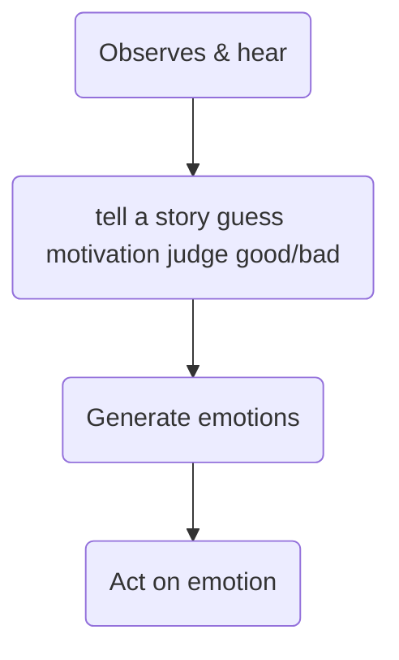

2021-12-29-We
Author::  [[Kerry Patterson]], [[Joseph Grenny]] , [[Al Switzler]] , [[Ron McMillan]]
Originally published:: ?
Type:: #notes
Tags::  [[self help]], [[non fiction]], [[conversation]], [[management]], [[organizational culture]], [[Reading/reading]]

# Crucial Conversations - Tools for Talking When Stakes Are High, Second Edition

# Crucial conversation:
- Opposing opinions
- High stakes
- Strong emotions
   
# Shared meaning
- Make it safe to add meaning to shared pool.

# Start with heart
- Best way to fix us is to start with me.
- Don't make *fools' choices* (Either, or)
- It is not our behaviour degenerate, it is our *motive*
- our heart unconsciously start try to win, punish, or keep the peace.
- Focus on what you really want
- Refuse the fools' choice

# Learn to look
- Learn to spot crucial conversation
- Look for safety problem
  - When it is safe, you can say anything.

# Silence and Violence 
- **Masking**: Sarcasm, sugarcoating
- **Avoiding**: Steering away topic
- **Withdraw**: Pull out of conversation

- *Controlling*: Cutting, overstate fact. Speaking absolute, change subject
- *Labeling*: To dismiss a label around general stereotype
- *Attacking*: Instead of win argument, make the person suffer.
*PS: Look for your style under stress*

# Make it safe
- *"Can we change gear for a minute"*
- People **don't like content** of conversation because they **don't trust the intent**.

Condition of safety: *Mutual purpose*
- Working towards common outcome
- Care about their goal, interest, value
- "Do other believe I care about their goals in this conversation"
- "Do they trust my motives"

# Mutual respect: Maintains conversation
- *"Do others believe I respect them"*
- Disrespect when we dwell on how other are different from us.
- "Lord help me forgive whose sin differently than I"

# Step out
- Apologize
- Contrast
- Create a mutual purpose

# Commitment to seek mutual purpose
- With heart commit to stay in conversation until reach a mutual purpose.
- Verbalize this commitment
- "It seems live we are both trying to force our view on each other. I commit to stay in this discussion until we have a solution that satisfy both of us."

# Recognize the purpose behind the strategy
- Strategy is not what we want
- Find the real goal

# Invent a mutual purpose
- When goals are not compatible
- A new purpose more meaningful

# Brainstorm new strategies

# Master my stories
## Emotions don't just happen
- Claim one: You and only you create your emotions
- Claim two: With strong emotions, you either master them or fall hostage to them.

## Stories create feelings

> [!quote] William Shakespeare
Nothin in this world is good or bad, but thinking makes it so

## Retrace your path
1.  [Act] Notice your behaviour am Iin some form of silence or violence
2.  [Feel] Get in touch with your feeling what emotions is getting me to act this way
3.  [Tell story] Analyze your stories. What stories is creating these emotions
4.  [See/hear] Get back to facts. What evidence do I have to support this story?
 
# State my path
- Maintain safety
  - Speak with confidence
  - Speak with humility
- Share your facts
- Tell your story
- Ask for other's path
- Talk tentatively
- Encourage testing

# Explore other's path
- Other party need to open up also
- Start with heart - get ready to listen
  - Be sincere (look for hint "mostly")
  - Be curious (Practise)
  - Stay curious
  - Be patient
  
# Retrace other's path
- Every sentence has a history
- Break the cycle

# Inquiring skills
- When? Select and invite to talk
- How?
- What?

# Ask, mirror, paraphrase, or prime (AMPP)
- Ask to get things rolling
- Mirror to confirm feelings
- Paraphrase to acknowledge the story
- Prime when you getting nowhere

# Understanding doesn't equate with agreement
- agree
- build
- compare