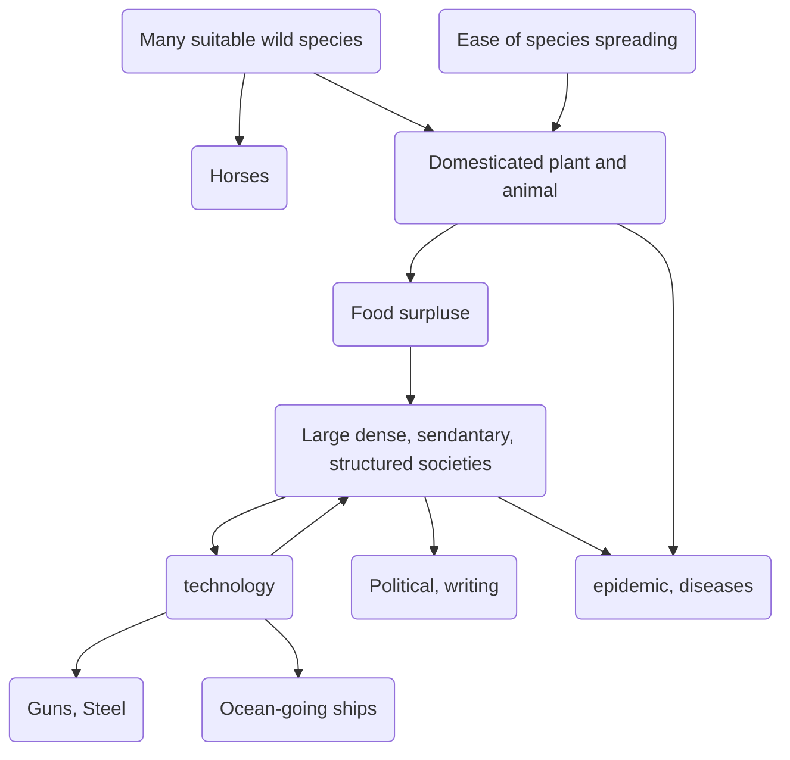

> [!note] Yali's question
>Why one group of people develope at such different rate compared to another?

[Cro-Magnon](https://en.wikipedia.org/wiki/Early_European_modern_humans) very likely replaced Neanderthals in Europe 40,000 years ago.

[Megafauna](https://en.wikipedia.org/wiki/Megafauna) extinction

Clovis hunters also killed off all big mammal in Americas

By 11,00 BC human have occupied all habatible contient on earth.

1835, [Moriori Genocide](https://en.wikipedia.org/wiki/Moriori_genocide) by Maori people. (Natural (experiments)
  The Moriori, were hunters and gathers, living on Chatham's colder climate unable to farm. Without **food surpluses**, they can't support non-hunting/craft specialists.
Environment affect economy, technology, political organization with a very short amount of time.

6 Environmental variables:
- Climate
- Geological type
- Marine Resource
- Area
- Terrain fragmentation
- Isolation

Ancestral Polynesians brought domesticated animals (pig, chicken and dog), but not any animal in Polynesian were domesticated, only provided occasional meals.

The larger the size and higher the density, the more complex and specialized were the technology and organization.

Environmentally related diversification of human societies.

Cajamarca:
  Spanish conquistador Francisco Pizarro capture of Inca emperor Atahualpa. November 16, 1532. The factors that result in Atahualpa capture offers a broader window into history.
  
**Guns**, **armor** and **horse**.

Early guns are **harquebuses**

Domestication of horse around 4000 BC, in the steppes north of Black Sea.

Small pox epidemic devastated the Aztecs at 1520.

Malaria, yellow fever of tropical diseases also provided obstacle to European colonization.

Writing allow information to be spread for more widely and more accurately.

Literacy made Spaniards/Europeans heir to huge body of knowledge about human behaviour.

Sedentary life style:
- Permit shorter birth interval
- Food storage

Food storage allow "A political elite" to arise.
Supporting full time specialist.

Human have taken over the "natural" selection of crop.
- Crop are selective bread for our benefit

Crop types, these are found all over the ancient world.
  - Cereals and other grass
  - Pulses
  - Fibre
  - Roots
  - Melons
- Large seed grass species are most common food/cereal source

 Large domestic animal are great source of aid to help farming, transportation, and food source.
 
### The major five and minor nine big herbivorous domestic mammals.
The major five:
    1. Sheep
    2. Goat
    3. Cow, alias OX or Cattle
    4. Pig
    5. Horse
All relatively large animal that is either **herbivorous** and **omnivorous**, that was common in one part of the world, but now world wide.

The minor nine:
  1. Arabian (one-humped) camel
  2. Bactrian (two-humped) camel
  3. Llama and Alpaca
  4. Donkey
  5. Reindeer
  6. Water Bufflo
  7. Yak
  8. Bali Cattle
  9. Mithan (AKA Gayal, Indian bison)
*Out of 14 ancient domestic animals 13 is confined to Eurasia*

> [!quote] Anna Karenia Rule
Happy families are all the like. Every unhappy family is unhappy in its own way.

## 6 Groups of reasons to failed domestication
1. Diet, an efficiency of food biomass to consumer's biomass. Hence carnivorous is expensive, and picky eaters.
2. Growth rate, limitation on availability.
3. Problems of captive breeding. Complicated mating ritual only possible in wild.
4. Nasty disposition: Power and murders
5. Tendency to panic: hard to keep in captivity
6. Social structure: Natural herd hierarchy that is also imprint-able to the leaders.

Food production spread faster out of south west Asia, than in America and Africa.

The fertile Crescent's founder crops were never re-domesticated anywhere else. The same food package started food production everywhere else in Eurasia.

Climate vary greatly depending on latitude.

Most of major human food source are some time of seed.

## Disease
Smallpox, flu, tuberculosis, malaria, cholera are all infections diseases evolved diseases of animal.

Germ kill its host is just a un-intended by product of most efficient method transmission.

Crowd diseases are easy to spread and react fas. People either die or become immune in short period of time.

In more remote/empty area, diseases are more long lasting such as yellow fever or malaria.

## Writing
Writing system 3 basic strategies:
1. Syllable (Alphabet)
2. Logogram (Chinese, Hieroglyphs, Maya glyphs, Sumerian cuneiform)
3. Syllabaries: Distinct signs just for syllables one consonant followed by one vowel. (Linear B)

Writing developed to keep track of more complex trade/politic. It need surplus food to feed scribers. Most language, writing, is borrowed from other system.

The writing reflect spoken language in some way.

[Phaistos disk](https://en.wikipedia.org/wiki/Phaistos_Disc) July 3, 1908

## Technology
"Necessity is the mother of invention"

Actually most invention was made first then found an application, or convinced the consumer it is useful.

- Steam engine, 1769, James Watts

- Phonograph, 1777, Thomas Edison
- Gas Engine, 1866, Nikolaus Otto
- Moto Cycle, 1885, Gottfried Daimler

"Heroic theory of invention" is over stated.

Technology develops cumulatively.

Factor influence acceptance of a technology:
  1. Relative economic advantage.
  2. Social value and prestige
  3. Compatibility with vested interest
  4. Ease of observed advantage
